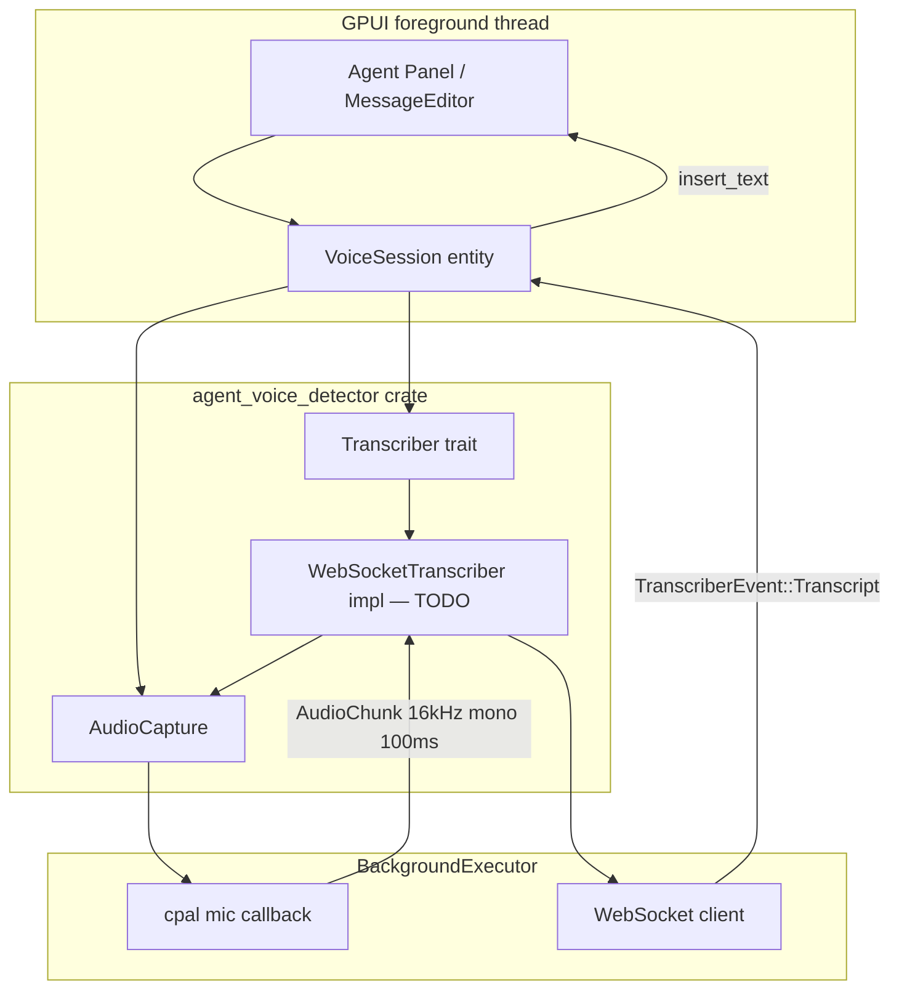
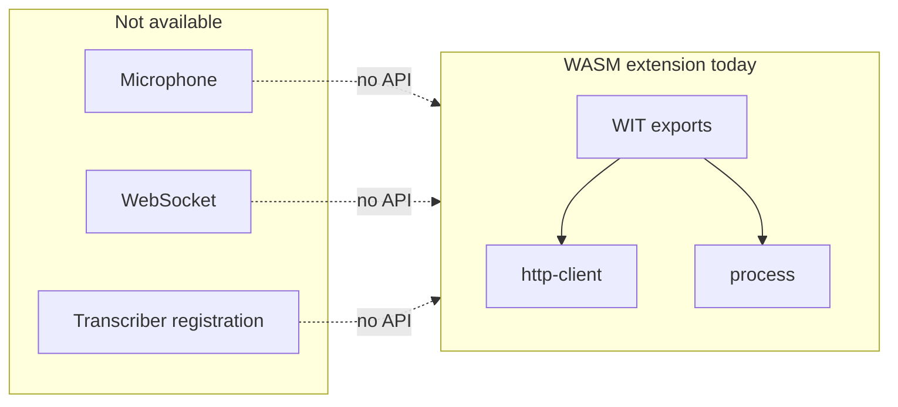
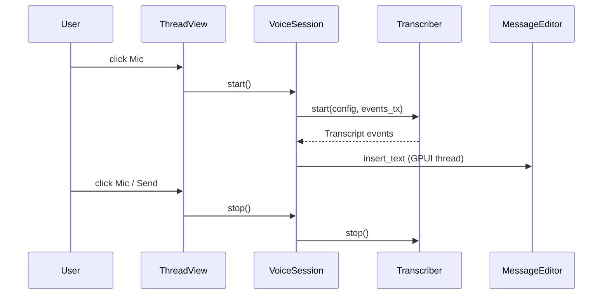

# agent_voice_detector

Crate for voice input in the Agent Panel: microphone capture and an abstract
[`Transcriber`](src/transcriber.rs) trait for streaming speech-to-text.

This document is a **developer guide** for implementing a concrete transcriber
(for example WebSocket STT) and explains whether that work can live in a **Zed
extension**.

---

## Table of contents

1. [Architecture](#architecture)
2. [Can this be implemented as a Zed extension?](#can-this-be-implemented-as-a-zed-extension)
3. [Recommended approach today (in-tree)](#recommended-approach-today-in-tree)
4. [Implementing `Transcriber` in Zed](#implementing-transcriber-in-zed)
5. [Audio protocol (STT client contract)](#audio-protocol-stt-client-contract)
6. [Wiring into Agent UI](#wiring-into-agent-ui)
7. [Workarounds that are not `Transcriber`](#workarounds-that-are-not-transcriber)
8. [Future: extension-based transcriber providers](#future-extension-based-transcriber-providers)
9. [Testing](#testing)

---

## Architecture



### Modules

| Module | Responsibility |
|--------|----------------|
| [`transcriber.rs`](src/transcriber.rs) | Abstract `Transcriber` trait, events, config, errors |
| [`audio_capture.rs`](src/audio_capture.rs) | Mic capture → PCM chunks (`AudioCapture`) |
| [`cpal_util.rs`](src/cpal_util.rs) | Device resolution, sample format conversion |

### `Transcriber` (abstract)

Implementations must:

- **`start`** — begin capture + streaming inference; send [`TranscriberEvent`](src/transcriber.rs) on a channel
- **`stop`** — end capture and close connections
- Run I/O on **`BackgroundExecutor`**; UI updates happen in `agent_ui` on the GPUI thread

Key types:

```rust
pub trait Transcriber: Send {
    fn state(&self) -> TranscriberState;
    fn start(
        &mut self,
        config: TranscriberConfig,
        events: mpsc::UnboundedSender<TranscriberEvent>,
        executor: BackgroundExecutor,
    ) -> Task<Result<(), TranscriberError>>;
    fn stop(&mut self) -> Task<Result<(), TranscriberError>>;
}
```

### `AudioCapture` (concrete)

Already implemented. Produces fixed-size PCM chunks:

| Default | Value |
|---------|-------|
| Sample rate | 16 000 Hz |
| Channels | 1 (mono) |
| Sample format | 16-bit signed PCM (`i16`) |
| Chunk duration | 100 ms |
| Samples per chunk | 1 600 |
| Bytes per chunk | 3 200 |

Override via [`AudioCaptureConfig`](src/audio_capture.rs):

```rust
AudioCaptureConfig {
    input_device: None,              // or Some(DeviceId) from AudioSettings
    sample_rate: 16_000,
    channel_count: 1,
    chunk_duration_ms: 100,
}
```

Usage sketch:

```rust
let (chunk_tx, mut chunk_rx) = mpsc::unbounded();
let mut capture = AudioCapture::new();

capture
    .start(AudioCaptureConfig::default(), chunk_tx, executor.clone())
    .detach();

// chunk_rx.next().await → AudioChunk { samples: Vec<i16>, ... }

capture.stop().detach();
```

**Lifecycle note:** after `stop()` returns, capture may still wind down briefly.
Wait for the `Task` from `start()` to finish (or for `state()` to become `Idle`)
before calling `start()` again.

---

## Can this be implemented as a Zed extension?

### Short answer: **no, not with the current extension platform**

A WASM extension **cannot** implement [`Transcriber`](src/transcriber.rs) today.

### Why

Zed extensions are **WebAssembly components** (`wasm32-wasip2`) loaded by
`extension_host` / `wasm_host`. They communicate with the editor through **WIT
imports/exports**, not native Rust traits.

Relevant docs and code:

- Extension SDK: [`crates/extension_api/README.md`](../extension_api/README.md)
- WIT surface: [`crates/extension_api/wit/since_v0.8.0/`](../extension_api/wit/since_v0.8.0/)
- Host implementation: [`crates/extension_host/src/wasm_host.rs`](../extension_host/src/wasm_host.rs)

#### What extensions **can** do

| API | Use case |
|-----|----------|
| `http-client` (`fetch`, `fetch_stream`) | HTTP request/response; one-way response body streaming |
| `process` (`run_command`) | Run a subprocess to completion (stdout/stderr only) |
| `context-server` | Spawn MCP / external binary |
| `slash-command` | Static or batch text generation |
| `language_model_providers` (manifest) | Register LLM providers (text, not mic) |

Capabilities are gated (`process:exec`, `download_file`, `npm:install`) — see
[`docs/src/extensions/capabilities.md`](../../docs/src/extensions/capabilities.md).

#### What `Transcriber` needs vs what extensions have

| Requirement | Extension support today |
|-------------|-------------------------|
| Microphone capture (`cpal`) | **None** — no audio/mic WIT import |
| Bidirectional WebSocket STT | **None** — no WebSocket WIT; HTTP ≠ WS |
| Continuous background streaming | **Limited** — `run_command` blocks until exit, no stdin pipe |
| Push partial transcripts into Agent prompt | **None** — no transcriber registration in `extension_host` |
| Implement native `Transcriber` trait | **Impossible** — trait uses `gpui::Task`, `cpal::DeviceId`, etc. |



#### Comparison: language model extensions

Extensions can declare `language_model_providers` in `extension.toml` and register
text LLM backends (see [`extension_host_proxy.rs`](../extension/src/extension_host_proxy.rs)).
That pattern covers **text completion**, not realtime audio. There is **no
analogous `transcriber_providers`** manifest entry or WIT interface yet.

### What an extension author can do **right now**

These are **not** equivalent to voice input in the Agent prompt:

| Approach | Limitation |
|----------|------------|
| MCP / context-server spawning external STT | Agent tool UX, not live dictation in `MessageEditor` |
| Slash command calling HTTP STT on a file | Batch, not streaming mic |
| `process:exec` running CLI STT | No stdin streaming, blocking, no partial results in editor |
| `fetch` to cloud STT | Extension cannot capture or stream mic audio |

---

## Recommended approach today (in-tree)

Implement the transcriber **inside the Zed repo**:

1. **`WebSocketTranscriber`** in `agent_voice_detector` (or a small sibling crate)
   — uses `AudioCapture` + `async-tungstenite`
2. **`VoiceSession`** entity in `agent_ui` — owns `AudioCapture` + `Transcriber`, forwards events to `MessageEditor`
3. **Mic button** in `thread_view.rs` — start/stop session

This matches how collab audio (`livekit_client`) and agent UI are built: native
Rust on `BackgroundExecutor`, GPUI for UI.

---

## Implementing `Transcriber` in Zed

### Step 1 — Add `WebSocketTranscriber`

Suggested file: `src/websocket_transcriber.rs`

Responsibilities:

```
start():
  1. Open WebSocket to config.websocket_url
  2. Start AudioCapture with AudioCaptureConfig { input_device: config.input_device, ..Default }
  3. Loop (select):
       - audio chunk from capture → Message::Binary (3200 bytes LE i16)
       - WS text/binary → parse transcript JSON → TranscriberEvent::Transcript
       - stop signal → close WS, stop capture
  4. Emit TranscriberEvent::Started / Stopped / Error

stop():
  Signal shutdown (oneshot), do not block on GPUI thread
```

Register in [`agent_voice_detector.rs`](src/agent_voice_detector.rs):

```rust
mod websocket_transcriber;
pub use websocket_transcriber::WebSocketTranscriber;
```

Add dependencies to [`Cargo.toml`](Cargo.toml): `async-tungstenite` (same features
as `crates/client`).

### Step 2 — Compose capture + network

Prefer **one owner** for the mic:

```text
WebSocketTranscriber
  ├── AudioCapture          (exclusive mic consumer)
  └── WebSocket connection  (binary uplink, JSON downlink)
```

Do not run `AudioCapture` and collab/LiveKit mic at the same time — check call
state before `start()` (see `crates/call`).

### Step 3 — Handle events on the GPUI thread

In `agent_ui`, subscribe to `TranscriberEvent`:

| Event | Action |
|-------|--------|
| `Started` | Optional UI state (recording indicator) |
| `Transcript { text, is_final }` | `MessageEditor::insert_text` for partial/final text |
| `Stopped` | Clear recording state |
| `Error { message }` | Show notification |

Use `cx.spawn` + `message_editor.update` — never call GPUI from the cpal callback or WS task directly.

### Step 4 — Settings

Extend agent settings (or a dedicated section) with:

```json
{
  "agent_voice": {
    "websocket_url": "ws://127.0.0.1:8765/transcribe",
    "sample_rate": 16000,
    "chunk_duration_ms": 100
  }
}
```

Map into `TranscriberConfig` + `AudioCaptureConfig`.

---

## Audio protocol (STT client contract)

Default wire format aligned with `AudioCapture` defaults:

### Uplink (Zed → STT server)

- **Transport:** WebSocket binary frames
- **Payload:** little-endian `i16` PCM
- **Format:** mono, 16 000 Hz
- **Frame size:** 1 600 samples = **3 200 bytes** per 100 ms chunk

Pseudocode:

```rust
let bytes: Vec<u8> = chunk
    .samples
    .iter()
    .flat_map(|sample| sample.to_le_bytes())
    .collect();
websocket.send(Message::Binary(bytes.into())).await?;
```

If you change `AudioCaptureConfig`, keep `samples_per_chunk()` and
`bytes_per_chunk()` in sync with the server.

### Downlink (STT server → Zed)

Recommended JSON (one object per message):

```json
{ "text": "hello world", "is_final": false }
```

Parse into `TranscriptUpdate { text, is_final }` → `TranscriberEvent::Transcript`.

Server may also send control messages (`{"error":"..."}`) → `TranscriberEvent::Error`.

---

## Wiring into Agent UI

Current state: mic button in
[`thread_view.rs`](../agent_ui/src/conversation_view/thread_view.rs) is a **placeholder**
(“ZedVC Voice Input” popover) and does **not** use this crate yet.

Target flow:



Send path: hook Send button to `VoiceSession::stop()` without duplicating
`MessageEditor::send()` logic.

---

## Workarounds that are not `Transcriber`

Document these for extension authors who cannot land in-tree code yet:

1. **External app + clipboard** — poor UX, not integrated
2. **MCP tool “transcribe file”** — file-based, not live mic in prompt
3. **Sidecar binary + IPC** — requires custom Zed build or future host API

None satisfy the Agent Panel voice input product spec.

---

## Future: extension-based transcriber providers

To support extensions properly, Zed would need **new platform work** (similar to
`language_model_providers`):

### Host (Zed core)

1. **WIT imports** (extension → host):
   - `transcriber: start(config) -> stream-id`
   - `transcriber: send-audio(stream-id, pcm: list<u8>)` *or* host-owned mic with callback into WASM
   - `transcriber: stop(stream-id)`
   - `websocket: connect(url) -> socket-id` / `socket-send` / `socket-recv` *or* host-managed WS proxy

2. **WIT exports** (host → extension):
   - `on-transcript(stream-id, text, is-final)`
   - `on-error(stream-id, message)`

3. **`extension.toml`** manifest entry, e.g. `transcriber_providers`

4. **`ExtensionHostProxy`** registration → `agent_ui` selects provider

5. **Capability** gating, e.g. `microphone:capture`, `network:websocket`

### Extension author (after API exists)

1. Implement WIT exports in Rust → WASM
2. Declare provider in `extension.toml`
3. In `start`, receive audio chunks from host *or* open WS via host and forward chunks
4. Return transcripts via `on-transcript`

### Why host-owned mic is likely

Letting WASM touch the microphone directly is unsafe and non-portable. The
practical model is:

```text
Host: AudioCapture → extension receives PCM chunks via WIT
Extension: protocol logic only (encode, WS framing, parse JSON)
Host: inject TranscriberEvent → MessageEditor
```

Until that exists, **in-tree `WebSocketTranscriber`** is the correct path.

---

## Testing

### Unit tests (crate)

```bash
cargo test -p agent_voice_detector
```

Existing tests cover default chunk sizing and config validation.

Suggested additions:

- `cpal_util`: sample format conversion
- transcript JSON parsing for your WS protocol
- mock `Transcriber` for `agent_ui` GPUI tests

### Manual

1. Run STT server expecting 16 kHz mono PCM WebSocket binary frames (3200 B / 100 ms)
2. Wire mic button → `VoiceSession`
3. Verify partial text appears in Agent prompt
4. Verify stop/release mic; verify collab call still works afterward

### GPUI tests

Follow [`/.agents/skills/gpui-test/SKILL.md`](../../.agents/skills/gpui-test/SKILL.md) when adding `agent_ui` integration tests.

---

## Related code in Zed

| Area | Path |
|------|------|
| Mic capture (collab) | `crates/livekit_client/src/livekit_client/playback.rs` |
| Audio settings | `crates/audio/src/audio_settings.rs` |
| Agent message editor | `crates/agent_ui/src/message_editor.rs` |
| Voice button (placeholder) | `crates/agent_ui/src/conversation_view/thread_view.rs` |
| Extension WIT | `crates/extension_api/wit/since_v0.8.0/` |

---

## Summary

| Question | Answer |
|----------|--------|
| Can I implement `Transcriber` in a Zed extension **today**? | **No** |
| Why? | No mic, WebSocket, or transcriber APIs in the extension WIT surface |
| What should I implement now? | In-tree `WebSocketTranscriber` + `agent_ui` wiring |
| What audio format? | Mono 16-bit PCM, 16 kHz, 100 ms chunks (1600 samples, 3200 bytes) |
| Will extensions ever support this? | Possible after new host APIs; mic should stay host-owned |

For questions about the voice input product flow, see the Agent Panel / voice
session design notes in the team repo docs.
